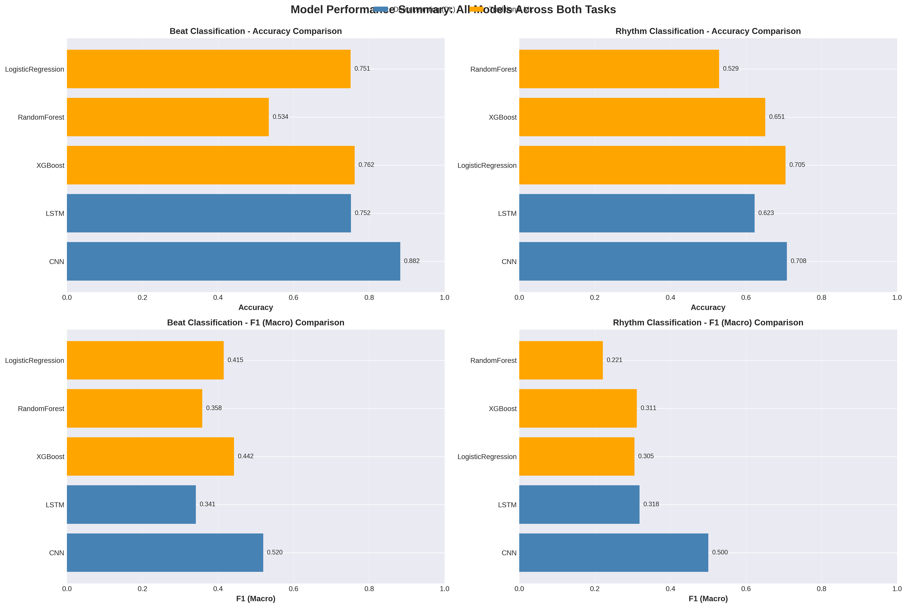
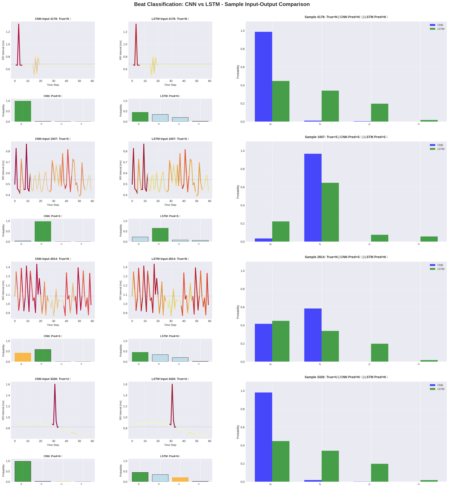
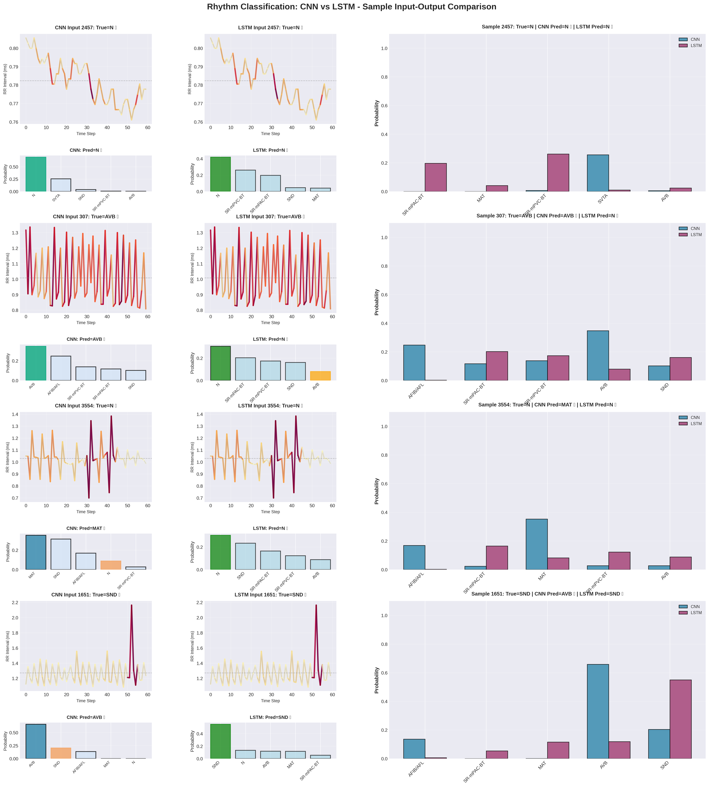
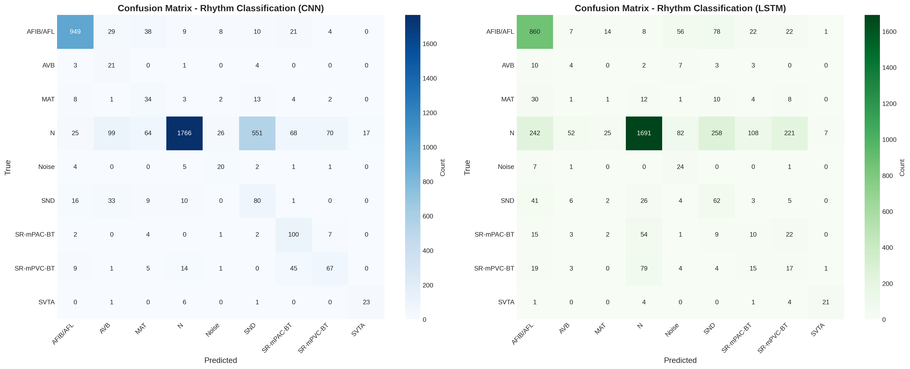
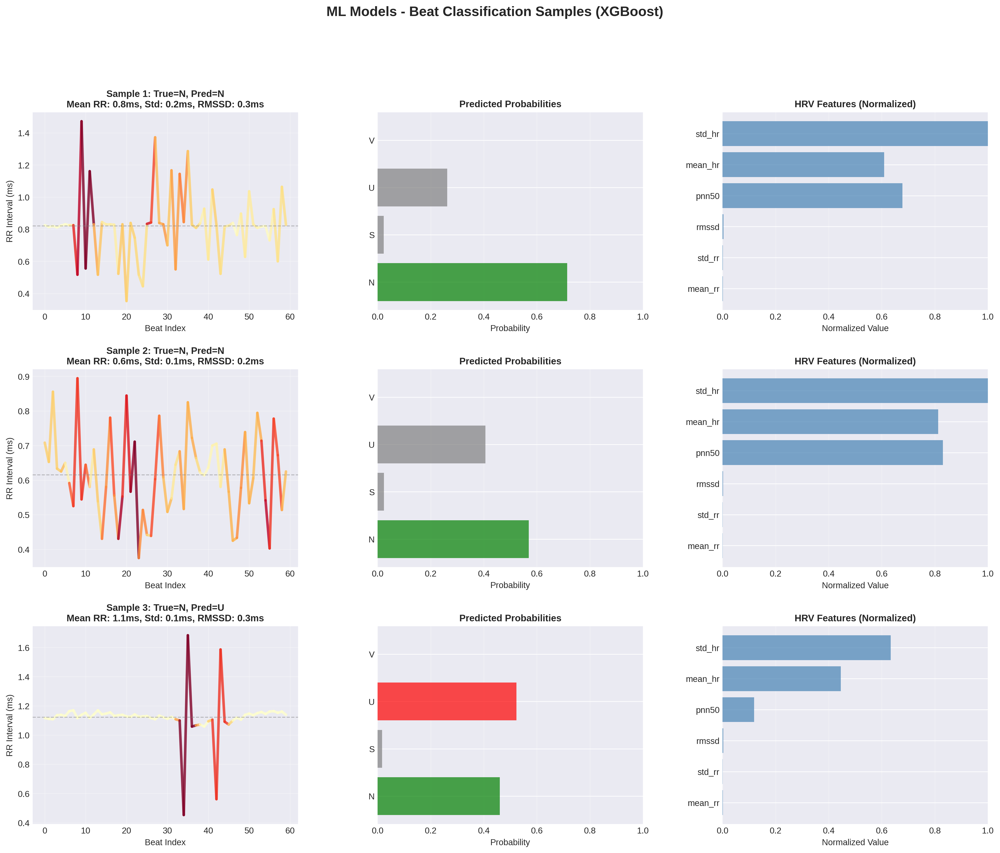
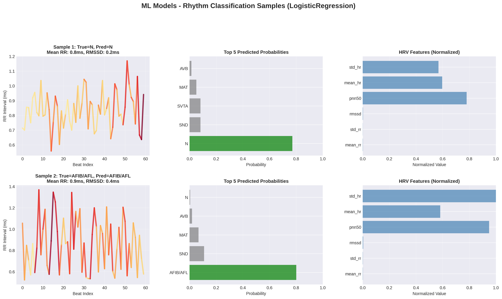

# Research Notes: Arrhythmia Classification from ECG Signals

## Suggested Paper Title

**"Multi-Level Arrhythmia Classification from ECG Signals: A Comparative Study of Deep Learning and Traditional Machine Learning Approaches on Window-Level Heart Rate Variability Features"**

*Alternative titles:*
- "Deep Learning vs. Traditional ML for ECG-Based Arrhythmia Detection: A Window-Level Comparative Analysis"
- "Heart Rate Variability-Based Arrhythmia Classification: An Integrated Deep Learning and Machine Learning Framework"

---

## 1. Research Overview

### 1.1 Objective
This research investigates and compares multiple machine learning and deep learning approaches for automatic arrhythmia classification from electrocardiogram (ECG) signals at two hierarchical levels: **beat-level** and **rhythm-level** classification.

### 1.2 Dataset
- **Source**: VitalDB Arrhythmia Database
- **Patients**: 482 cases
- **Data Format**: ECG waveforms with R-peak annotations
- **Labels**: Expert-annotated beat types and rhythm classifications
- **Exclusions**: Unclassifiable beats/rhythms, VT (Ventricular Tachycardia), and missing annotations are filtered out

### 1.3 Classification Tasks

#### Task 1: Beat-Level Classification
- **Classes**: 4 beat types
  - **N**: Normal beats
  - **S**: Supraventricular beats
  - **V**: Ventricular beats
  - **U**: Unknown/Unclassified beats
- **Granularity**: Individual heartbeat classification

#### Task 2: Rhythm-Level Classification
- **Classes**: Multiple rhythm types (primary classes include AFIB/AFL, SR, etc.)
- **Granularity**: Overall cardiac rhythm classification over time segments

---

## 2. Methodology

### 2.1 Data Preprocessing Pipeline

#### 2.1.1 Data Loading
```
VitalDB Database
    ↓
Load Metadata (482 cases)
    ↓
Load Annotation Files (per case)
    ↓
Filter Excluded Classes (Unclassifiable, VT, NaN)
    ↓
Extract R-peak Timestamps
```

#### 2.1.2 Window Creation
To ensure fair comparison between deep learning and traditional ML models, a **window-level approach** is adopted:

- **Window Size**: 60 consecutive beats
- **Stride**: 30 beats (50% overlap)
- **Rationale**: 
  - Captures sufficient temporal context for rhythm classification
  - Maintains computational efficiency
  - Enables direct comparison between DL (sequence-based) and ML (feature-based) approaches

**Window Creation Process**:
1. Calculate RR intervals from R-peak timestamps
2. Create overlapping windows of 60 RR intervals
3. Assign window-level labels using majority voting:
   - **Beat classification**: Majority beat type in window
   - **Rhythm classification**: Majority rhythm in window
4. Filter windows containing excluded classes

#### 2.1.3 Data Splitting
- **Strategy**: Patient-level splitting to prevent data leakage
- **Split Ratio**: 60% train / 20% validation / 20% test
- **Random Seed**: 42 (for reproducibility)
- **Stratification**: Applied when class distribution allows (≥2 samples per class)

**Key Feature**: All models (DL and ML) use **identical patient splits**, ensuring fair comparison.

### 2.2 Feature Extraction

#### 2.2.1 Deep Learning Features
- **Input Format**: Raw RR interval sequences (60 values per window)
- **Preprocessing**: 
  - StandardScaler normalization (fit on train, transform on val/test)
  - Sequence shape: (n_windows, 60)

#### 2.2.2 Traditional ML Features
- **Input Format**: HRV (Heart Rate Variability) features extracted per window
- **Feature Set** (10 features per window):
  1. `mean_rr`: Mean RR interval
  2. `std_rr`: Standard deviation of RR intervals
  3. `rmssd`: Root Mean Square of Successive Differences
  4. `pnn50`: Percentage of RR intervals differing by >50ms
  5. `pnn20`: Percentage of RR intervals differing by >20ms
  6. `min_rr`: Minimum RR interval
  7. `max_rr`: Maximum RR interval
  8. `range_rr`: Range of RR intervals
  9. `mean_hr`: Mean heart rate
  10. `std_hr`: Standard deviation of heart rate
- **Preprocessing**: StandardScaler normalization

**Feature Extraction Process**:
```
RR Interval Window (60 values)
    ↓
Calculate HRV Statistics
    ↓
Extract 10 HRV Features
    ↓
Normalize (StandardScaler)
    ↓
Feature Vector (10 dimensions)
```

### 2.3 Model Architectures

#### 2.3.1 Deep Learning Models

**A. Lightweight 1D-CNN** (`beat_dl.ipynb`, `rhythm_dl.ipynb`)
```
Architecture:
- Input: (batch_size, 1, 60) - RR interval sequences
- Conv1D(1 → 32, kernel=5, padding=2) + ReLU
- MaxPool1D(2)
- Conv1D(32 → 64, kernel=5, padding=2) + ReLU
- MaxPool1D(2)
- Flatten → FC(64*15 → 128) + ReLU
- Dropout(0.3)
- FC(128 → num_classes)

Parameters: ~50K-100K (depending on num_classes)
```

**B. Lightweight LSTM** (`beat_lstm.ipynb`, `rhythm_lstm.ipynb`)
```
Architecture:
- Input: (batch_size, 60, 1) - RR interval sequences
- LSTM(input_size=1, hidden_size=64, num_layers=2)
- Dropout(0.2)
- FC(64 → num_classes)

Parameters: ~30K-60K (depending on num_classes)
```

#### 2.3.2 Traditional ML Models (`trad_ml.ipynb`)

**A. XGBoost**
- Regularized gradient boosting
- Hyperparameters:
  - `n_estimators=200`, `max_depth=3`, `learning_rate=0.03`
  - `min_child_weight=7`, `subsample=0.7`, `colsample_bytree=0.7`
  - `reg_alpha=0.1`, `reg_lambda=1.0` (L1/L2 regularization)

**B. Random Forest**
- Ensemble of decision trees
- Hyperparameters:
  - `n_estimators=200`, `max_depth=6`
  - `min_samples_split=10`, `min_samples_leaf=5`
  - `max_features='sqrt'`

**C. Logistic Regression**
- Linear classifier with L2 regularization
- Hyperparameters:
  - `C=0.1` (strong regularization)

**Advanced Techniques Applied**:
- **Class Weighting**: Balanced class weights for imbalanced datasets
- **Sample Weighting**: Applied during training for XGBoost, RandomForest
- **Probability Calibration**: `CalibratedClassifierCV` (isotonic/sigmoid) for reliable probability estimates

### 2.4 Training Configuration

#### 2.4.1 Deep Learning Training
- **Optimizer**: Adam
- **Loss Function**: CrossEntropyLoss with class weights
- **Learning Rate**: 0.001 (with learning rate scheduling)
- **Batch Size**: 32-64 (depending on available memory)
- **Epochs**: Early stopping based on validation loss
- **Regularization**: Dropout layers, weight decay

#### 2.4.2 Traditional ML Training
- **Imbalance Handling**: 
  - Class weights: `compute_class_weight('balanced', ...)`
  - Sample weights: Applied to training samples
- **Validation**: Separate validation set for probability calibration
- **Model Persistence**: All trained models saved using `joblib`

### 2.5 Evaluation Metrics

**Comprehensive Metric Suite**:
1. **Accuracy**: Overall classification accuracy
2. **Precision (Macro)**: Unweighted mean precision across classes
3. **Precision (Weighted)**: Sample-weighted mean precision
4. **Recall (Macro)**: Unweighted mean recall across classes
5. **Recall (Weighted)**: Sample-weighted mean recall
6. **F1-Score (Macro)**: Unweighted mean F1-score
7. **F1-Score (Weighted)**: Sample-weighted mean F1-score
8. **AUROC (Macro)**: Macro-averaged Area Under ROC Curve (one-vs-rest)
9. **AUPRC (Macro)**: Macro-averaged Area Under Precision-Recall Curve

**Rationale**: Macro metrics treat all classes equally (important for rare classes), while weighted metrics account for class imbalance (important for overall performance).

---

## 3. Experimental Results

### 3.1 Beat Classification Results

| Model | Accuracy | F1 (Macro) | F1 (Weighted) | AUROC (Macro) | AUPRC (Macro) |
|-------|----------|------------|---------------|---------------|---------------|
| **CNN** | **0.8821** | **0.5195** | **0.8874** | 0.8665 | **0.5082** |
| **XGBoost** | 0.7617 | 0.4424 | 0.8233 | **0.9153** | 0.4796 |
| **LogisticRegression** | 0.7508 | 0.4149 | 0.8058 | 0.7767 | 0.4575 |
| **LSTM** | 0.7518 | 0.3411 | 0.7419 | 0.6994 | 0.3576 |
| **RandomForest** | 0.5343 | 0.3585 | 0.6446 | 0.8428 | 0.4623 |

**Key Findings**:
- **CNN achieves best overall performance** (Accuracy: 88.21%, F1-Macro: 51.95%)
- **XGBoost shows best AUROC** (91.53%), indicating strong discriminative ability
- **LSTM underperforms** compared to CNN (possibly due to limited sequence length)
- **RandomForest shows lowest accuracy** (53.43%), suggesting overfitting or insufficient regularization

### 3.2 Rhythm Classification Results

| Model | Accuracy | F1 (Macro) | F1 (Weighted) | AUROC (Macro) | AUPRC (Macro) |
|-------|----------|------------|---------------|---------------|---------------|
| **CNN** | **0.7082** | **0.5004** | **0.7640** | **0.9307** | **0.5326** |
| **LogisticRegression** | 0.7048 | 0.3046 | 0.7507 | 0.8843 | 0.3639 |
| **XGBoost** | 0.6508 | 0.3110 | 0.7147 | 0.8833 | 0.3527 |
| **LSTM** | 0.6225 | 0.3182 | 0.6656 | 0.8242 | 0.3216 |
| **RandomForest** | 0.5289 | 0.2212 | 0.6073 | 0.8296 | 0.2991 |

**Key Findings**:
- **CNN is the clear winner** across all major metrics
- **LogisticRegression performs surprisingly well** (Accuracy: 70.48%), second only to CNN
- **AUROC values are high** (>0.82 for all models), indicating good class separation
- **F1-Macro scores are lower** than beat classification, reflecting increased difficulty and class imbalance

### 3.3 Comparative Analysis

#### 3.3.1 Deep Learning vs. Traditional ML

**Beat Classification**:
- **DL (CNN) dominates**: Best accuracy, F1-Macro, and AUPRC
- **ML (XGBoost) shows competitive AUROC**: Indicates strong probability calibration
- **Observation**: CNN benefits from learning sequential patterns directly from raw RR intervals

**Rhythm Classification**:
- **CNN maintains superiority**: Best across all metrics
- **LogisticRegression competitive**: Suggests that HRV features capture relevant rhythm patterns
- **LSTM underperforms**: May require longer sequences or different architecture for rhythm classification

#### 3.3.2 Task Difficulty

**Beat Classification** (4 classes):
- **Higher accuracy** across all models (53-88%)
- **Better class balance** (F1-Macro: 34-52%)
- **Easier task**: Distinct beat morphologies

**Rhythm Classification** (multiple classes):
- **Lower accuracy** across all models (53-71%)
- **Greater class imbalance** (F1-Macro: 22-50%)
- **Harder task**: Requires longer-term temporal patterns

#### 3.3.3 Model Characteristics

| Model Type | Strengths | Weaknesses |
|------------|-----------|------------|
| **CNN** | Best overall performance, captures local patterns | Requires more parameters, GPU training |
| **XGBoost** | Excellent AUROC, interpretable | Lower macro-F1 (may favor majority classes) |
| **LogisticRegression** | Simple, fast, competitive on rhythm task | Limited to linear patterns |
| **LSTM** | Designed for sequences | Underperforms compared to CNN |
| **RandomForest** | Robust to outliers | Lowest performance, possible overfitting |

---

## 4. Visualizations

### 4.1 Available Figures

All figures are saved in `experiments/results/plots/`:

1. **`beat_dl_sample_comparison.png`**: CNN vs LSTM sample input-output comparisons for beat classification
2. **`rhythm_dl_sample_comparison.png`**: CNN vs LSTM sample input-output comparisons for rhythm classification
3. **`beat_ml_sample_visualization_xgboost.png`**: ML model (XGBoost) sample visualizations with feature importance for beat classification
4. **`rhythm_ml_sample_visualization_logisticregression.png`**: ML model (LogisticRegression) sample visualizations for rhythm classification
5. **`rhythm_confusion_matrices_dl.png`**: Confusion matrices comparing CNN and LSTM for rhythm classification
6. **`overall_performance_summary.png`**: Comprehensive performance summary charts comparing all models across both tasks

### 4.2 Key Visualization Insights

**From Sample Comparisons**:
- Input signals (RR intervals) are visualized with feature importance highlighting
- Output probabilities show model confidence and prediction quality
- HRV features are displayed as normalized bar charts

**From Performance Summary**:
- Clear visual comparison of accuracy and F1-Macro across all models
- Color-coded by model type (DL vs ML) for easy identification
- Demonstrates CNN superiority in both tasks

### 4.3 Figure References

**Overall Performance Summary**:


**Beat Classification - DL Sample Comparison**:


**Rhythm Classification - DL Sample Comparison**:


**Rhythm Classification - Confusion Matrices**:


**Beat Classification - ML Sample Visualization (XGBoost)**:


**Rhythm Classification - ML Sample Visualization (LogisticRegression)**:


---

## 5. Research Pipeline Flowchart

### 5.1 Experimental Pipeline Overview

The complete experimental pipeline follows a structured approach from raw ECG data to final model evaluation. The flowchart below illustrates the key stages:

```
┌─────────────────────────────────────────────────────────────────┐
│                    VITALDB ARRHYTHMIA DATABASE                  │
│                      (482 Patient Cases)                        │
│              Expert-Annotated ECG Waveforms                     │
└───────────────────────────┬─────────────────────────────────────┘
                            │
                            ▼
        ┌──────────────────────────────────────────┐
        │        DATA PREPROCESSING PHASE          │
        │  • Load metadata and annotation files    │
        │  • Filter excluded classes (VT, NaN)     │
        │  • Extract R-peak timestamps             │
        └──────────────────────────────────────────┘
                            │
                            ▼
              ┌───────────────────────┐
              │  Calculate RR         │
              │  Intervals            │
              │  (time between beats) │
              └───────────┬───────────┘
                          │
                          ▼
        ┌─────────────────────────────────────────────┐
        │     WINDOW CREATION (window_size=60,        │
        │                  stride=30)                 │
        │  • Overlapping windows of 60 RR intervals  │
        │  • Majority voting for window labels       │
        └───────────────────┬─────────────────────────┘
                            │
        ┌───────────────────┴───────────────────┐
        │                                       │
        ▼                                       ▼
┌──────────────────────┐          ┌──────────────────────┐
│  Beat Classification │          │ Rhythm Classification│
│  • 4 classes (N,S,V,U)│         │  • Multiple classes  │
│  • Window-level labels│         │  • Window-level      │
└──────────┬───────────┘          └──────────┬───────────┘
           │                                 │
           └───────────────┬─────────────────┘
                           │
                           ▼
              ┌────────────────────────┐
              │  Patient-Level Split   │
              │  • Train: 60%          │
              │  • Validation: 20%     │
              │  • Test: 20%           │
              │  • Random seed: 42     │
              └───────────┬────────────┘
                          │
        ┌─────────────────┴─────────────────┐
        │                                   │
        ▼                                   ▼
┌──────────────────────┐        ┌──────────────────────┐
│  DEEP LEARNING       │        │  TRADITIONAL ML      │
│  BRANCH              │        │  BRANCH              │
└──────────────────────┘        └──────────────────────┘
        │                                   │
        │                                   ▼
        │                      ┌──────────────────────┐
        │                      │  Extract HRV         │
        │                      │  Features (10)       │
        │                      │  • mean_rr, std_rr   │
        │                      │  • rmssd, pnn50      │
        │                      │  • etc.              │
        │                      └──────────┬───────────┘
        │                                 │
        │                                 ▼
        │                      ┌──────────────────────┐
        │                      │  StandardScaler      │
        │                      │  Normalization       │
        │                      └──────────┬───────────┘
        │                                 │
        ▼                                 ▼
┌──────────────────────┐        ┌──────────────────────┐
│  Raw RR Sequences    │        │  HRV Feature         │
│  • Shape: (n, 60)    │        │  Vectors (10 dims)   │
│  • Normalized        │        │  • Normalized        │
└──────────┬───────────┘        └──────────┬───────────┘
           │                               │
    ┌──────┴──────┐                ┌──────┴──────┐
    │             │                │             │
    ▼             ▼                ▼             ▼
┌────────┐   ┌────────┐    ┌──────────┐  ┌──────────┐
│  CNN   │   │  LSTM  │    │ XGBoost  │  │ RandomF  │
│  1D-CNN│   │  2-layer│   │          │  │ LogReg   │
│        │   │        │    │ Regularized│ Regularized│
└───┬────┘   └───┬────┘    └────┬─────┘  └────┬─────┘
    │            │              │             │
    │            │              └──────┬──────┘
    │            │                     │
    └────────────┴─────────────────────┘
                   │
                   ▼
        ┌──────────────────────┐
        │   MODEL TRAINING     │
        │   • Class Weights    │
        │   • Early Stopping   │
        │   • Validation       │
        │   • Probability Cal. │
        └──────────┬───────────┘
                   │
                   ▼
        ┌──────────────────────┐
        │   MODEL EVALUATION   │
        │   • Test Set         │
        │   • 9 Metrics        │
        │   • Per-Class Analysis│
        └──────────┬───────────┘
                   │
                   ▼
        ┌──────────────────────┐
        │  SAVE PREDICTIONS    │
        │  & MODELS            │
        │  • .pkl files        │
        │  • Model checkpoints │
        └──────────┬───────────┘
                   │
                   ▼
        ┌──────────────────────┐
        │  VISUALIZATION &     │
        │  COMPARISON          │
        │  • Confusion matrices│
        │  • ROC/PR curves     │
        │  • Sample analysis   │
        │  • Performance tables│
        └──────────────────────┘
```

### 5.2 Pipeline Stages Description

1. **Data Loading**: 482 patient cases from VitalDB with expert annotations
2. **Preprocessing**: Filter excluded classes, extract RR intervals
3. **Windowing**: Create 60-beat windows with 30-beat stride (50% overlap)
4. **Label Assignment**: Majority voting for window-level labels
5. **Data Splitting**: Patient-level splits (60/20/20) to prevent leakage
6. **Feature Extraction**: 
   - DL: Raw RR sequences (normalized)
   - ML: HRV features (10 dimensions, normalized)
7. **Model Training**: 5 models (CNN, LSTM, XGBoost, RandomForest, LogisticRegression)
8. **Evaluation**: Comprehensive metrics on test set
9. **Visualization**: Sample analysis, confusion matrices, performance comparisons

---

## 6. Key Research Contributions

### 6.1 Methodological Contributions

1. **Window-Level Comparative Framework**: Established a fair comparison framework where both DL and ML models operate on the same 60-beat windows, ensuring identical data granularity.

2. **Unified Data Pipeline**: Single preprocessing pipeline that generates both sequence-based (DL) and feature-based (ML) inputs from the same source data, eliminating discrepancies.

3. **Comprehensive Evaluation**: Extended evaluation beyond accuracy to include macro and weighted metrics, addressing class imbalance concerns in clinical datasets.

### 6.2 Technical Contributions

1. **Lightweight Architectures**: Designed computationally efficient CNN and LSTM models suitable for real-time applications on resource-constrained devices.

2. **Advanced ML Techniques**: Integrated probability calibration, class weighting, and regularization for traditional ML models, demonstrating competitive performance.

3. **Multi-Task Evaluation**: Simultaneous evaluation of beat-level and rhythm-level classification provides insights into hierarchical arrhythmia detection.

### 6.3 Clinical Relevance

1. **Two-Level Classification**: Addresses both immediate (beat-level) and long-term (rhythm-level) arrhythmia detection needs.

2. **Interpretability**: ML models provide HRV feature importance, aiding clinical interpretation.

3. **Real-World Applicability**: Window-based approach mimics clinical practice of analyzing ECG segments.

---

## 7. Limitations and Future Directions

### 7.1 Current Limitations

1. **Class Imbalance**: Despite class weighting, rare classes (e.g., 'U' beats) remain challenging.
2. **Sequence Length**: 60-beat windows may be insufficient for complex rhythm patterns requiring longer context.
3. **Feature Engineering**: ML models rely on hand-crafted HRV features, which may miss subtle patterns.
4. **Dataset Size**: 482 patients, while substantial, may benefit from additional data for rare classes.

### 7.2 Future Directions

1. **Ensemble Methods**: Combine CNN and XGBoost predictions for improved performance.
2. **Attention Mechanisms**: Incorporate attention layers in LSTM/CNN for better long-range dependencies.
3. **Transfer Learning**: Pre-train models on larger ECG datasets.
4. **Multi-Modal Input**: Incorporate additional signal channels (ECG leads) beyond ECG_II.
5. **Explainable AI**: Integrate SHAP or LIME for model interpretability.
6. **Real-Time Deployment**: Optimize models for edge devices and real-time monitoring.

---

## 8. Conclusions

This research provides a comprehensive comparison of deep learning and traditional machine learning approaches for arrhythmia classification from ECG signals. Key findings include:

1. **CNN emerges as the best-performing model** for both beat and rhythm classification tasks, achieving 88.21% and 70.82% accuracy respectively.

2. **Traditional ML models (particularly XGBoost and LogisticRegression) show competitive performance**, especially in terms of AUROC, demonstrating that well-engineered features can rival deep learning in certain scenarios.

3. **The window-level approach ensures fair comparison** and enables consistent evaluation across different model types.

4. **Rhythm classification is inherently more challenging** than beat classification, as reflected in lower F1-Macro scores and greater class imbalance effects.

5. **Feature engineering remains valuable**: While DL models learn from raw sequences, ML models using HRV features achieve competitive results with better interpretability.

The research framework established here provides a foundation for future work in automated arrhythmia detection and classification, with potential applications in clinical decision support systems and continuous patient monitoring.

---

## 9. References to Generated Results

### 9.1 Performance Metrics
- **File**: `experiments/results/metrics/overall_performance_comparison.csv`
- **Content**: Complete performance metrics for all models on both tasks

### 9.2 Visualizations
- **Directory**: `experiments/results/plots/`
- **Key Figures**:
  - `overall_performance_summary.png`: Overall comparison of all models
  - `beat_dl_sample_comparison.png`: Beat classification sample comparisons
  - `rhythm_dl_sample_comparison.png`: Rhythm classification sample comparisons
  - `beat_ml_sample_visualization_xgboost.png`: ML model beat analysis
  - `rhythm_ml_sample_visualization_logisticregression.png`: ML model rhythm analysis
  - `rhythm_confusion_matrices_dl.png`: Confusion matrix comparison

### 9.3 Model Artifacts
- **Directory**: `experiments/results/predictions/`
- **Contains**: All trained models, encoders, and prediction files for reproducibility

---

## 10. Reproducibility Notes

### 10.1 Environment Setup
- **Python**: 3.10+
- **Key Libraries**: PyTorch, scikit-learn, XGBoost, pandas, numpy, matplotlib, seaborn
- **Requirements**: See `requirements_arrdb.txt`

### 10.2 Execution Order
Refer to `EXP_GUIDE.md` for step-by-step notebook execution instructions.

### 10.3 Data Splits
- All models use identical patient splits (random_state=42)
- Window parameters: window_size=60, stride=30
- Split ratio: 60/20/20 (train/val/test)

### 10.4 Model Checkpoints
- Trained models saved in `experiments/results/predictions/`
- Predictions saved for all models to enable visualization and further analysis

---

**Document Version**: 1.0  
**Last Updated**: Based on latest experimental results  
**Author**: Research Assistant  
**Project**: VitalDB Arrhythmia Classification

