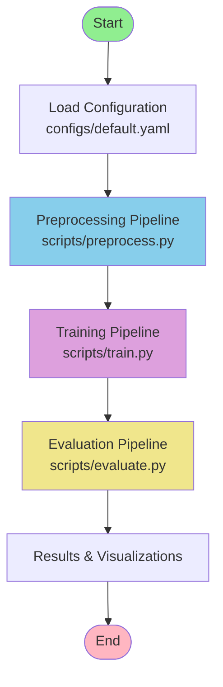
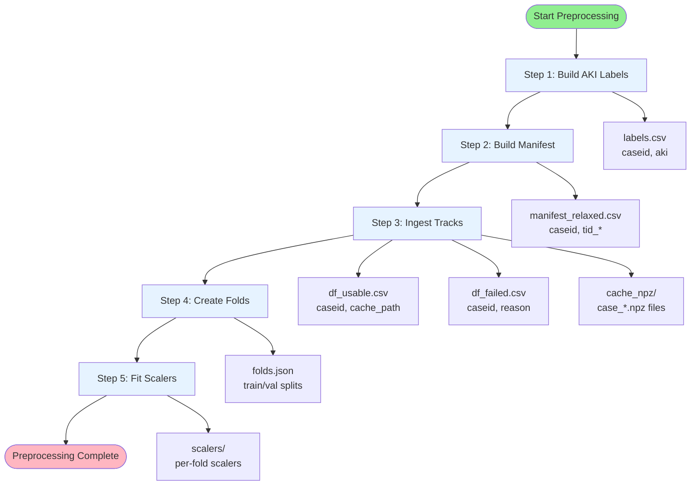
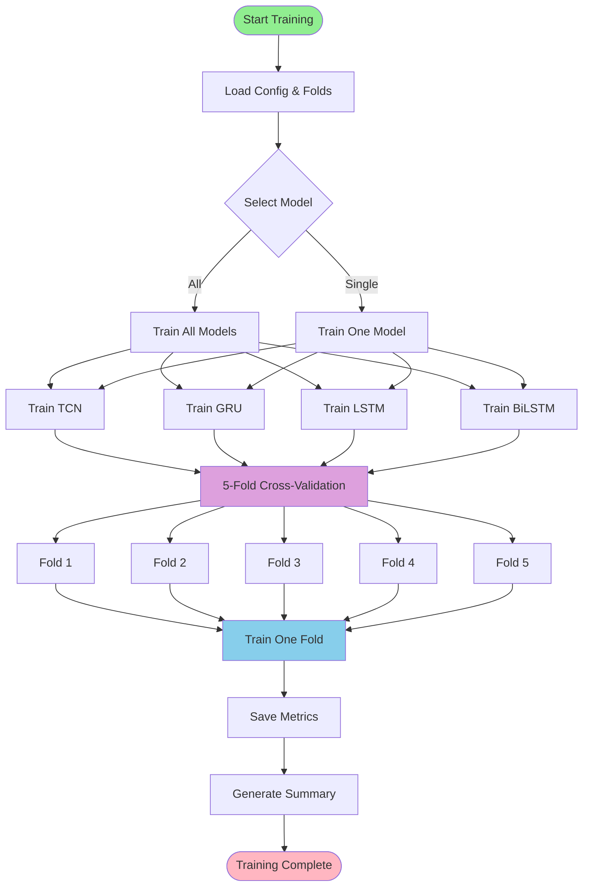
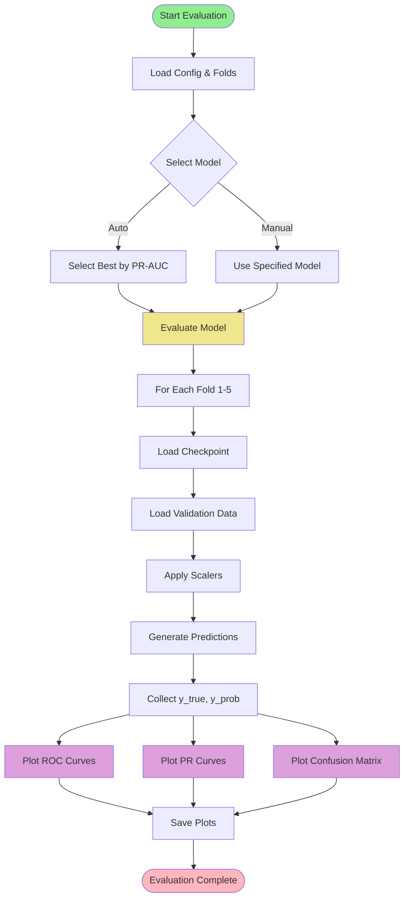

# VitalDB AKI Prediction - Project Workflow

This document provides a comprehensive visual representation of the entire project workflow, from data preprocessing to model training and evaluation. The diagrams are designed to be intuitive and can be easily recreated in tools like draw.io, Lucidchart, or similar diagramming software.

---

## Table of Contents

1. [Overall Pipeline Overview](#overall-pipeline-overview)
2. [Data Preprocessing Pipeline](#data-preprocessing-pipeline)
3. [Training Pipeline](#training-pipeline)
4. [Evaluation Pipeline](#evaluation-pipeline)
5. [Data Flow Diagram](#data-flow-diagram)
6. [File Structure and Artifacts](#file-structure-and-artifacts)
7. [Model Architecture Overview](#model-architecture-overview)

---

## Overall Pipeline Overview

### High-Level Workflow



### ASCII Art Version

```
┌─────────────────────────────────────────────────────────────────┐
│                    VITALDB AKI PREDICTION PIPELINE               │
└─────────────────────────────────────────────────────────────────┘

    [Start]
      │
      ▼
┌─────────────────┐
│ Load Config     │  configs/default.yaml
│ - Signals       │  - Hyperparameters
│ - Paths         │  - Model settings
└────────┬────────┘
         │
         ▼
┌─────────────────┐
│ PREPROCESSING   │  scripts/preprocess.py
│ Pipeline        │  - Build labels
│                 │  - Ingest tracks
│                 │  - Create folds
│                 │  - Fit scalers
└────────┬────────┘
         │
         ▼
┌─────────────────┐
│ TRAINING        │  scripts/train.py
│ Pipeline        │  - 5-fold CV
│                 │  - 4 models (TCN, GRU, LSTM, BiLSTM)
│                 │  - Early stopping
└────────┬────────┘
         │
         ▼
┌─────────────────┐
│ EVALUATION      │  scripts/evaluate.py
│ Pipeline        │  - Load checkpoints
│                 │  - Compute metrics
│                 │  - Generate plots
└────────┬────────┘
         │
         ▼
    [Results]
```

---

## Data Preprocessing Pipeline

### Detailed Preprocessing Steps



### Step-by-Step Breakdown

#### Step 1: Build AKI Labels

```
┌─────────────────────────────────────────────────────────────┐
│ STEP 1: Build AKI Labels                                     │
└─────────────────────────────────────────────────────────────┘

Input:  VitalDB API (lab data)
        ↓
Process: Extract creatinine values
         - Baseline: [-30 days, 0] before surgery
         - Postop: [0, +7 days] after surgery
         ↓
Logic:   AKI = 1 if postop_max_cr ≥ 1.5 × baseline_cr
         ↓
Output: labels.csv
         Columns: caseid, aki (0/1)
```

#### Step 2: Build Manifest

```
┌─────────────────────────────────────────────────────────────┐
│ STEP 2: Build Manifest                                       │
└─────────────────────────────────────────────────────────────┘

Input:  labels.csv + VitalDB API (track metadata)
        ↓
Process: Map case IDs to track IDs for each signal
         - Match signal names using regex patterns
         - Filter to cases with all required signals
         ↓
Output: manifest_relaxed.csv
         Columns: caseid, tid_ART_MBP, tid_ART_SBP, tid_ART_DBP,
                  tid_HR, tid_ETCO2
```

#### Step 3: Ingest Tracks

```
┌─────────────────────────────────────────────────────────────┐
│ STEP 3: Ingest Tracks (Most Complex Step)                   │
└─────────────────────────────────────────────────────────────┘

For each case in manifest:
    │
    ├─► Fetch track data from VitalDB API
    │   (or load from cache: tables/tracks/*.csv)
    │
    ├─► For each signal:
    │   │
    │   ├─► Load irregular time series (time, value)
    │   │
    │   ├─► Resample to uniform 1 Hz grid
    │   │   - Interpolate missing values
    │   │   - Create mask channel (1=observed, 0=missing)
    │   │
    │   ├─► Apply signal-specific transforms:
    │   │   - ART_MBP: Clip to [0, 200]
    │   │   - ART_SBP: Clip to [0, 300]
    │   │   - ART_DBP: Clip to [0, 200]
    │   │   - HR: Clip to [0, 250]
    │   │   - ETCO2: Clip to [0, 100]
    │   │
    │   └─► Apply mask: signal = signal * mask
    │
    ├─► Concatenate all signals + masks
    │   Shape: [2×n_signals, T] where T = max_len_sec
    │
    ├─► Quality Gates:
    │   - Check min_obs_points_per_channel (≥60)
    │   - Check min_len_sec (≥600 seconds)
    │   - Check required signals present
    │
    └─► Save to NPZ file: cache_npz/case_{caseid}.npz
        Contents: x (tensor), valid_len, grid_t, cutoff_sec, obs_counts

Output: df_usable.csv (successful cases)
        df_failed.csv (failed cases with reasons)
        cache_npz/case_*.npz (preprocessed tensors)
```

#### Step 4: Create Folds

```
┌─────────────────────────────────────────────────────────────┐
│ STEP 4: Create Folds                                        │
└─────────────────────────────────────────────────────────────┘

Input:  labels.csv + manifest.csv + df_usable.csv
        ↓
Process: Merge all dataframes
         Filter to usable cases only
         ↓
Split:  StratifiedKFold (n_splits=5, random_state=42)
        - Preserve class distribution across folds
        - Split at case level (not time step level)
        ↓
Output: folds.json
         Structure: [
           {
             "fold": 1,
             "train_caseids": [1, 2, 3, ...],
             "val_caseids": [100, 101, ...],
             "n_train": 1930,
             "n_val": 483,
             "train_pos": 81,
             "val_pos": 20
           },
           ...
         ]
        
        cohort_master.csv
        (merged labels + manifest + usable cases)
```

#### Step 5: Fit Scalers

```
┌─────────────────────────────────────────────────────────────┐
│ STEP 5: Fit Scalers (Per Fold)                              │
└─────────────────────────────────────────────────────────────┘

For each fold (1-5):
    │
    ├─► Load training cases only
    │   (Prevent data leakage!)
    │
    ├─► For each signal channel:
    │   │
    │   ├─► Extract observed values only (mask-aware)
    │   │
    │   ├─► Fit scaler:
    │   │   - StandardScaler (mean, std) for all channels
    │   │
    │   └─► Save scaler parameters
    │
    └─► Save to: scalers/scalers_fold{N}.json

Output: scalers/scalers_fold1.json ... scalers_fold5.json
        fold_scalers_index.json (mapping)
```

---

## Training Pipeline

### Training Workflow



### Training One Fold (Detailed)

```
┌─────────────────────────────────────────────────────────────┐
│ TRAINING ONE FOLD                                           │
└─────────────────────────────────────────────────────────────┘

Input:  Model name, fold_idx, train_caseids, val_caseids, config
        ↓
Check:  Checkpoint exists? (if not --force)
        ↓ Yes → Load checkpoint → Evaluate → Return metrics
        ↓ No  → Continue to training
        ↓
┌─────────────────────────────────────────────────────────────┐
│ Training Loop                                                │
└─────────────────────────────────────────────────────────────┘

1. Create DataLoaders:
   - Train: DemoFoldDataset(train_caseids, fold_idx, config)
   - Val:   DemoFoldDataset(val_caseids, fold_idx, config)
   
2. Load & Apply Scalers:
   - Load scalers for this fold
   - Apply normalization to training data
   - Apply same scalers to validation data
   
3. Initialize Model:
   - Build model architecture (TCN/GRU/LSTM/BiLSTM)
   - Input dim: 2 × n_signals (signals + masks)
   - Hidden dim: 64, Layers: 2, Dropout: 0.2
   
4. Setup Training:
   - Optimizer: AdamW (lr=0.001, weight_decay=0.0001)
   - Loss: BCEWithLogitsLoss with pos_weight
   - Monitor: PR-AUC (or ROC-AUC)
   - Early stopping: patience=5
   
5. Training Loop (epochs 1-20):
   │
   ├─► For each batch in train_loader:
   │   │
   │   ├─► Forward pass: logits = model(X, lengths)
   │   │
   │   ├─► Compute loss: loss = criterion(logits, y)
   │   │
   │   ├─► Backward pass: loss.backward()
   │   │
   │   ├─► Gradient clipping: clip_grad_norm_(max_norm=5.0)
   │   │
   │   └─► Optimizer step: optimizer.step()
   │
   ├─► Evaluate on validation set:
   │   │
   │   ├─► model.eval()
   │   │
   │   ├─► For each batch in val_loader:
   │   │   - Forward pass (no grad)
   │   │   - Collect predictions: y_prob = sigmoid(logits)
   │   │   - Collect true labels: y_true
   │   │
   │   └─► Compute metrics: ROC-AUC, PR-AUC
   │
   ├─► Check if best score:
   │   - If better → Save checkpoint
   │   - If not → Increment bad counter
   │
   └─► Early stopping check:
       - If bad >= patience → Stop training
       
6. Load Best Checkpoint:
   - Load model state from best epoch
   - Final evaluation on validation set
   
7. Return Results:
   - FoldResult(model, fold, roc_auc, pr_auc, trained, best_epoch)

Output: Checkpoint: models/{model}/fold{N}.pt
        Metrics: results/{model}_5fold_metrics.csv
```

### Model Architectures

```
┌─────────────────────────────────────────────────────────────┐
│ MODEL ARCHITECTURES                                         │
└─────────────────────────────────────────────────────────────┘

Input Shape: [batch_size, T, input_dim]
             where input_dim = 2 × n_signals = 10
             (5 signals + 5 masks)

┌─────────────────────────────────────────────────────────────┐
│ TCN (Temporal Convolutional Network)                         │
├─────────────────────────────────────────────────────────────┤
│ Input [B, T, 10]                                            │
│   ↓                                                          │
│ TCN Layers (levels=6, hidden=64, kernel=3)                 │
│   - Dilated convolutions                                    │
│   - Residual connections                                    │
│   - Dropout (0.2)                                           │
│   ↓                                                          │
│ Global Average Pooling (over time)                         │
│   ↓                                                          │
│ Linear(64 → 1)                                              │
│   ↓                                                          │
│ Output: [B, 1] (logits)                                     │
└─────────────────────────────────────────────────────────────┘

┌─────────────────────────────────────────────────────────────┐
│ GRU / LSTM / BiLSTM                                         │
├─────────────────────────────────────────────────────────────┤
│ Input [B, T, 10]                                            │
│   ↓                                                          │
│ RNN Layer(s) (hidden_dim=64, num_layers=2)                 │
│   - GRU: Gated Recurrent Unit                               │
│   - LSTM: Long Short-Term Memory                            │
│   - BiLSTM: Bidirectional LSTM                             │
│   - Dropout (0.2)                                           │
│   ↓                                                          │
│ Take last hidden state (or concatenate for BiLSTM)         │
│   ↓                                                          │
│ Linear(hidden_dim → 1)                                      │
│   ↓                                                          │
│ Output: [B, 1] (logits)                                    │
└─────────────────────────────────────────────────────────────┘
```

---

## Evaluation Pipeline

### Evaluation Workflow



### Evaluation Process

```
┌─────────────────────────────────────────────────────────────┐
│ EVALUATION PROCESS                                          │
└─────────────────────────────────────────────────────────────┘

For each fold (1-5):
    │
    ├─► Load checkpoint: models/{model}/fold{N}.pt
    │
    ├─► Load validation cases: val_caseids from folds.json
    │
    ├─► Create DataLoader:
    │   - DemoFoldDataset(val_caseids, fold_idx, config)
    │   - Apply scalers (from fold-specific scalers)
    │
    ├─► Generate predictions:
    │   - model.eval()
    │   - For each batch:
    │     * Forward pass: logits = model(X, lengths)
    │     * Apply sigmoid: y_prob = sigmoid(logits)
    │     * Collect: y_true, y_prob
    │
    └─► Compute metrics:
        - ROC-AUC: roc_auc_score(y_true, y_prob)
        - PR-AUC: average_precision_score(y_true, y_prob)
        - Confusion matrix (at threshold=0.5)
        - Accuracy, Precision, Recall, F1

Generate Visualizations:
    │
    ├─► ROC Curves:
    │   - Plot ROC curve for each fold
    │   - Show AUC in legend
    │   - Save: results/{model}_roc.png
    │
    ├─► PR Curves:
    │   - Plot PR curve for each fold
    │   - Show AP (Average Precision) in legend
    │   - Show prevalence baseline
    │   - Save: results/{model}_pr.png
    │
    └─► Confusion Matrix:
        - Aggregate predictions across all folds
        - Plot confusion matrix at threshold=0.5
        - Show accuracy, precision, recall, F1
        - Save: results/{model}_cm.png

Output: results/{model}_roc.png
        results/{model}_pr.png
        results/{model}_cm.png
        (Metrics already saved during training)
```

---

## Data Flow Diagram

### Complete Data Flow

```mermaid
graph LR
    subgraph "Data Sources"
        API[VitalDB API<br/>Lab Data & Tracks]
    end
    
    subgraph "Preprocessing"
        Labels[labels.csv]
        Manifest[manifest_relaxed.csv]
        NPZ[cache_npz/<br/>case_*.npz]
        Usable[df_usable.csv]
        Folds[folds.json]
        Scalers[scalers/<br/>fold_*.json]
    end
    
    subgraph "Training"
        Models[models/<br/>{model}/fold*.pt]
        Metrics[results/<br/>*_metrics.csv]
    end
    
    subgraph "Evaluation"
        Plots[results/<br/>*_roc.png, *_pr.png, *_cm.png]
        Summary[results/<br/>all_models_summary.csv]
    end
    
    API --> Labels
    API --> Manifest
    Manifest --> NPZ
    NPZ --> Usable
    Labels --> Folds
    Usable --> Folds
    Folds --> Scalers
    
    Folds --> Models
    Scalers --> Models
    NPZ --> Models
    Models --> Metrics
    
    Models --> Plots
    Metrics --> Summary
    Metrics --> Plots
    
    style API fill:#FFE4B5
    style NPZ fill:#E6F3FF
    style Models fill:#DDA0DD
    style Plots fill:#F0E68C
```

### ASCII Data Flow

```
┌─────────────────────────────────────────────────────────────────┐
│                        DATA FLOW DIAGRAM                         │
└─────────────────────────────────────────────────────────────────┘

VitalDB API
    │
    ├─► Lab Data ──────────┐
    │                       │
    └─► Track Metadata ────┤
                           │
                           ▼
                    ┌──────────────┐
                    │ Preprocessing│
                    └──────┬───────┘
                           │
        ┌──────────────────┼──────────────────┐
        │                  │                  │
        ▼                  ▼                  ▼
   labels.csv      manifest_relaxed.csv   Track CSVs
        │                  │                  │
        │                  └────────┬─────────┘
        │                           │
        └───────────┬───────────────┘
                    │
                    ▼
            ┌───────────────┐
            │ Ingest Tracks │
            └───────┬───────┘
                    │
        ┌───────────┼───────────┐
        │           │           │
        ▼           ▼           ▼
   df_usable.csv  df_failed.csv  cache_npz/
                                      case_*.npz
        │
        ▼
   ┌──────────────┐
   │ Create Folds│
   └──────┬───────┘
          │
    ┌─────┴─────┐
    │           │
    ▼           ▼
folds.json  cohort_master.csv
    │
    ▼
┌──────────────┐
│ Fit Scalers │
└──────┬───────┘
       │
       ▼
  scalers/
  fold_*.json
       │
       ▼
┌──────────────┐
│   Training   │
└──────┬───────┘
       │
   ┌───┴───┐
   │       │
   ▼       ▼
models/  results/
fold*.pt  *_metrics.csv
   │
   ▼
┌──────────────┐
│  Evaluation  │
└──────┬───────┘
       │
       ▼
  results/
  *_roc.png
  *_pr.png
  *_cm.png
  summary.csv
```

---

## File Structure and Artifacts

### Directory Tree

```
vitaldb_aki/
├── configs/
│   └── default.yaml              # Configuration file
├── scripts/
│   ├── preprocess.py             # Preprocessing script
│   ├── train.py                  # Training script
│   └── evaluate.py                # Evaluation script
├── src/
│   └── vitaldb_aki/
│       ├── config.py             # Config management
│       ├── data/
│       │   ├── loaders.py         # Data loading
│       │   └── preprocessing.py  # Preprocessing functions
│       ├── models/
│       │   └── architectures.py  # Model definitions
│       ├── training/
│       │   ├── dataset.py         # PyTorch Dataset
│       │   └── trainer.py         # Training logic
│       ├── evaluation/
│       │   ├── metrics.py        # Metric computation
│       │   └── visualizations.py # Plotting functions
│       └── utils/
│           ├── paths.py          # Path management
│           └── helpers.py        # Helper functions
└── artifacts/
    └── new_optional_exp/
        ├── config.json           # Saved config
        ├── labels.csv            # AKI labels
        ├── manifest_relaxed.csv  # Track mappings
        ├── df_usable.csv         # Successful cases
        ├── df_failed.csv         # Failed cases
        ├── cohort_master.csv     # Merged dataset
        ├── folds.json            # CV splits
        ├── cache_npz/            # Preprocessed tensors
        │   └── case_*.npz
        ├── tables/               # Cached track CSVs
        │   └── tracks/
        │       └── *.csv
        ├── scalers/              # Per-fold scalers
        │   ├── scalers_fold1.json
        │   └── ...
        ├── models/               # Trained models
        │   ├── tcn/
        │   │   └── fold*.pt
        │   ├── gru/
        │   ├── lstm/
        │   └── bilstm/
        └── results/              # Results & plots
            ├── tcn_5fold_metrics.csv
            ├── gru_5fold_metrics.csv
            ├── lstm_5fold_metrics.csv
            ├── bilstm_5fold_metrics.csv
            ├── all_models_5fold_summary.csv
            ├── tcn_roc.png
            ├── tcn_pr.png
            └── ...
```

### Key Artifacts Description

| File/Directory | Description | Format |
|----------------|-------------|--------|
| `labels.csv` | AKI labels for each case | CSV: caseid, aki |
| `manifest_relaxed.csv` | Case-to-track mappings | CSV: caseid, tid_* |
| `cache_npz/case_*.npz` | Preprocessed time-series tensors | NumPy compressed |
| `folds.json` | Cross-validation splits | JSON: train/val caseids |
| `scalers/scalers_fold*.json` | Normalization parameters | JSON: per-signal stats |
| `models/{model}/fold*.pt` | Trained model checkpoints | PyTorch state_dict |
| `results/*_metrics.csv` | Performance metrics | CSV: roc_auc, pr_auc |
| `results/*.png` | Visualization plots | PNG images |

---

## Model Architecture Overview

### Input Processing

```
Raw Time Series (Irregular)
    ↓
Resample to 1 Hz Grid
    ↓
Apply Signal Transforms
    ↓
Create Mask Channels
    ↓
Concatenate: [signals, masks]
    ↓
Shape: [2×n_signals, T]
    ↓
Apply Quality Gates
    ↓
Save to NPZ
```

### Model Input/Output

```
Input Tensor Shape: [batch_size, T, input_dim]
    where:
    - batch_size: variable (padded to max length in batch)
    - T: sequence length (up to max_len_sec = 14400)
    - input_dim: 2 × n_signals = 10
      (5 signal channels + 5 mask channels)

Output: [batch_size, 1] logits
    ↓
Apply sigmoid → probabilities [0, 1]
    ↓
Threshold at 0.5 → binary predictions
```

### Training Data Flow

```
NPZ Files (cache_npz/)
    ↓
Load case by caseid
    ↓
Apply fold-specific scalers
    ↓
Batch into DataLoader
    ↓
Pad sequences to same length
    ↓
Feed to model
    ↓
Compute loss & backprop
    ↓
Save checkpoint (best epoch)
```

---

## Workflow Summary Table

| Stage | Script | Input | Output | Key Functions |
|-------|--------|-------|--------|---------------|
| **Preprocessing** | `preprocess.py` | VitalDB API | NPZ files, folds, scalers | `build_aki_labels()`, `ingest_tracks()`, `create_folds()`, `fit_scalers()` |
| **Training** | `train.py` | NPZ files, folds, scalers | Model checkpoints, metrics | `train_all_folds()`, `train_or_load_one_fold()` |
| **Evaluation** | `evaluate.py` | Model checkpoints, folds | Plots, metrics | `plot_roc_curves()`, `plot_pr_curves()`, `plot_confusion_matrix()` |

---

## Notes for Diagram Recreation

### Color Scheme Suggestions

- **Start/End nodes**: Green (#90EE90) / Pink (#FFB6C1)
- **Preprocessing**: Light Blue (#87CEEB, #E6F3FF)
- **Training**: Purple (#DDA0DD)
- **Evaluation**: Yellow (#F0E68C)
- **Data files**: Light Gray (#F5F5F5)
- **API/External**: Peach (#FFE4B5)

### Shape Conventions

- **Rectangles**: Processes/Functions
- **Cylinders**: Data storage (files, databases)
- **Diamonds**: Decision points
- **Rounded rectangles**: Start/End points
- **Parallelograms**: Input/Output

### Layout Tips

1. **Top to Bottom**: Overall flow direction
2. **Left to Right**: Data transformations
3. **Grouping**: Use containers/boxes for related processes
4. **Annotations**: Add notes for complex steps
5. **Legend**: Include color/shape legend

---

**Last Updated:** December 27, 2024

**Note:** This document uses Mermaid diagrams which can be rendered in many markdown viewers (GitHub, GitLab, VS Code with extensions, etc.). For tools like draw.io, use the ASCII art versions and descriptions as reference.

